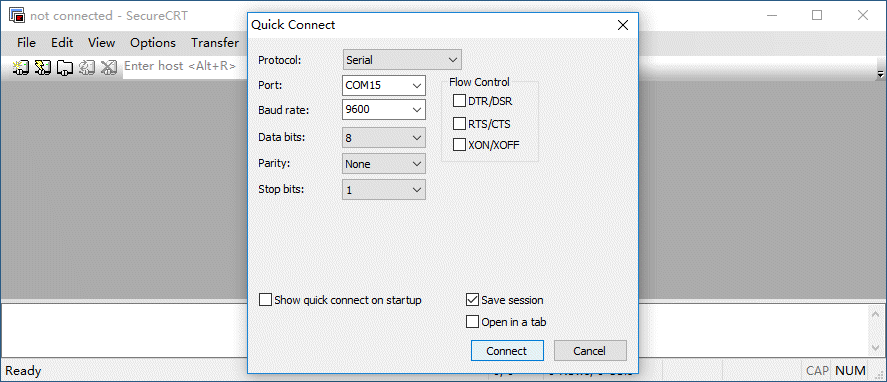
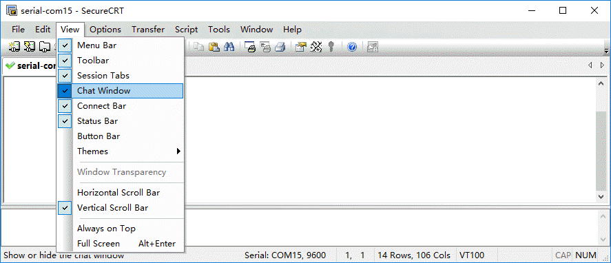
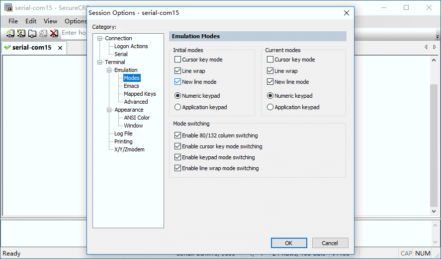
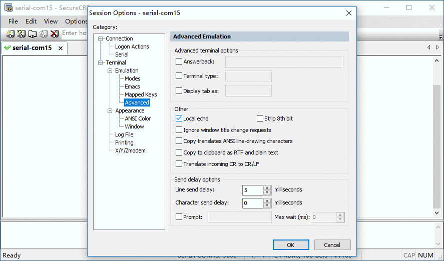
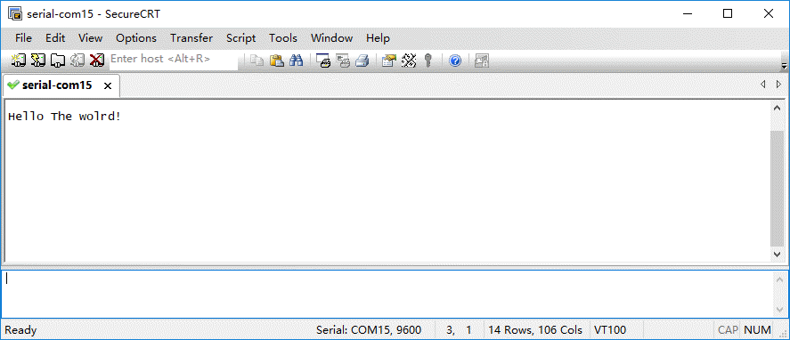

# 实验-1 Mbed的第一个程序
## 实验目的
了解Mbed离线开发环境，实验使用modular-2完成第一个程序HelloWorld烧录。
## 实验设备
### 硬件：
+ modular-2一台（V1.3）
+ PC电脑一台
### 软件：
+ WINDOWS 7操作系统
+ [SecureCRT终端仿真程序](https://www.vandyke.com/download/securecrt/download.html)
+ [Visulal Studio Code编辑器](https://visualstudio.microsoft.com/zh-hans/downloads/)
+ [Mbed CLI命令行工具](http://mbed-os.s3-eu-west-1.amazonaws.com/builds/Mbed_installer_v0.4.7.exe) 
## 实验原理
### Mbed CLI命令行工具介绍
Mbed CLI是Arm Mbed OS的命令行工具，它可以代码仓库版本控制、依赖管理、代码发布、从其他地方获取代码、调用编译系统及其他。Mbed CLI可以管理多项目，也就是多个项目可以分享同一个Mbed OS的源代码。如果你采用github代码仓库的话，你只需要上传应用程序的代码，而不需要上传几百兆的Mbed OS在github上，同样可以实现代码分享和版本控制。
我们在modular-2应用程序的开发过程中，采取将代码保存在github上，使用Mbed CLI实现程序编译的方法。
### Windows Mbed CLI运行

WIN键+R键，cmd回车进入命令行，输入mbed运行，将显示Mbed CLI的常见参数。
```
C:\>mbed
usage: mbed [-h] [--version]             ...
Command-line code management tool for ARM mbed OS - http://www.mbed.com
version 1.7.2
Use 'mbed  -h|--help' for detailed help.
Online manual and guide available at https://github.com/ARMmbed/mbed-cli
optional arguments:
  -h, --help   show this help message and exit
  --version    print version number and exit
Commands:
    new        Create new mbed program or library
    import     Import program from URL
    add        Add library from URL
    remove     Remove library
    deploy     Find and add missing libraries
    publish    Publish program or library
    update     Update to branch, tag, revision or latest
    ......
```
mbed config –L检查配置
```
C:\>mbed config -L
[mbed] Global config:
GCC_ARM_PATH=C:\Program Files (x86)\GNU Tools ARM Embedded\6 2017-q2-update\bin

[mbed] Local config (C:\):
Couldn't find valid mbed program in C:\
```
如果没有配置下GCC的路径（你安装GNU ARM的路径），请按如下命令设置：
```
mbed config --global GCC_ARM_PATH "C:\Program Files （x86）\ GNU Tools ARM Embedded\6 2017-q2-update\bin"
```
## 实验内容
### 代码生成
可以在线导入helloworld范例，或者直接本地生成项目目录后，使用编辑器进行源码输入。
#### github在线导入
```C:\>mbed import https://github.com/modular2/helloworld
[mbed] Importing program "helloworld" from "https://github.com/modular2/helloworld" at latest revision in the current branch
[mbed] Adding library "mbed-os" from "https://github.com/ARMmbed/mbed-os" at rev#949cb49ab0a1
[mbed] Auto-installing missing Python modules...
C:\cd helloworld
C:\helloworld>mbed compile -S//检查一下支持列表
[mbed] Auto-installing missing Python modules...
......
| NUCLEO_F413ZH         | Supported | Supported | Supported | Supported | Supported |     -     | Supported | Supported |
| NUCLEO_F429ZI         | Supported | Supported | Supported | Supported | Supported |     -     | Supported | Supported |
| NUCLEO_F439ZI         | Supported | Supported | Supported | Supported | Supported |     -     | Supported | Supported |
| NUCLEO_F446RE         | Supported | Supported | Supported | Supported | Supported |     -     | Supported | Supported |
| NUCLEO_F446ZE         | Supported | Supported | Supported | Supported | Supported |     -     | Supported | Supported |
| NUCLEO_F746ZG         | Supported | Supported | Supported | Supported | Supported |     -     | Supported | Supported |
......
Supported targets: 270
```
#### 编辑器输入源码
生成项目目录helloworld
```
C:\>mbed new helloworld
[mbed] Creating new program "helloworld" (git)
[mbed] Adding library "mbed-os" from "https://github.com/ARMmbed/mbed-os" at branch/tag "latest"
[mbed] Updating reference "mbed-os" -> "https://github.com/ARMmbed/mbed-os/#610e35ddc6d59f153173c1e7b2748cf96d6c9bcd"
[mbed] Auto-installing missing Python modules...
```
使用编辑器输入源码，编译器推荐使用[Visulal Studio Code](https://visualstudio.microsoft.com/zh-hans/downloads/)或[Notepad++](https://github.com/donho/notepad-plus-plus)。
```
#include "mbed.h"
DigitalOut myled(PC_6);
int main() {
    printf("Hello The wolrd!\n");
    while(1) {
        myled = !myled; 
        wait(1.0); // 1 sec
    }
}
```
生成main.cpp后，另存至helloworld目录。

### 编译
针对Modular-2进行编译时，开发板选择使用相同CPU的NUCLEO_F429ZI。
```C:\helloworld>mbed compile -t GCC_ARM -m NUCLEO_F429ZI
[mbed] Auto-installing missing Python modules...
Building project helloworld (NUCLEO_F429ZI, GCC_ARM)
Scan: helloworld
Scan: env
Compile [  0.2%]: mbed_tz_context.c
Compile [  0.3%]: AnalogIn.cpp
Compile [  0.5%]: main.cpp
Compile [  0.7%]: BusIn.cpp
Compile [  0.8%]: BusInOut.cpp
Compile [  1.0%]: BusOut.cpp
Compile [  1.2%]: CAN.cpp
Compile [  1.3%]: Ethernet.cpp
Compile [  1.5%]: FlashIAP.cpp
Compile [  1.7%]: I2CSlave.cpp
Compile [  1.8%]: I2C.cpp
......
Link: helloworld
Elf2Bin: helloworld
| Module           |         .text |       .data |          .bss |
|------------------|---------------|-------------|---------------|
| [fill]           |     148(+148) |       3(+3) |       21(+21) |
| [lib]\c.a        | 25037(+25037) | 2472(+2472) |       89(+89) |
| [lib]\gcc.a      |   3168(+3168) |       0(+0) |         0(+0) |
| [lib]\misc       |     252(+252) |     16(+16) |       28(+28) |
| main.o           |       98(+98) |       4(+4) |       28(+28) |
| mbed-os\drivers  |     283(+283) |       4(+4) |     100(+100) |
| mbed-os\events   |   1611(+1611) |       0(+0) |   1576(+1576) |
| mbed-os\features |   2070(+2070) |       0(+0) | 12692(+12692) |
| mbed-os\hal      |   1685(+1685) |       4(+4) |       68(+68) |
| mbed-os\platform |   2843(+2843) |   260(+260) |     133(+133) |
| mbed-os\rtos     | 12404(+12404) |   168(+168) |   6073(+6073) |
| mbed-os\targets  | 10129(+10129) |       5(+5) |     680(+680) |
| Subtotals        | 59728(+59728) | 2936(+2936) | 21488(+21488) |
Total Static RAM memory (data + bss): 24424(+24424) bytes
Total Flash memory (text + data): 62664(+62664) bytes

Image: .\BUILD\NUCLEO_F429ZI\GCC_ARM\helloworld.bin
```
编译结束生成helloworld.bin文件。
### 联机烧录
1. 将modular-2设备通过USB(DAPLink接口)连接开发电脑。
2. 将生成的bin文件复制到modular-2生成的存储盘符中。
3. 按复位键启动嵌入式程序。
### 程序运行
#### 复位运行
modular-2复位后，开始运行程序，程序为绿灯每秒闪烁一次。
#### 串口监控
PC电脑通过数据线连接Modular-2，并运行SecureCRT设置为串口模式，选择Modular-2在系统中生成的串口，打开互动窗口后，进行SecureCRT会话设置。
##### 串口设置

##### 打开互动窗口

##### 会话模式设置

##### 本地回显设置

##### 运行监视

