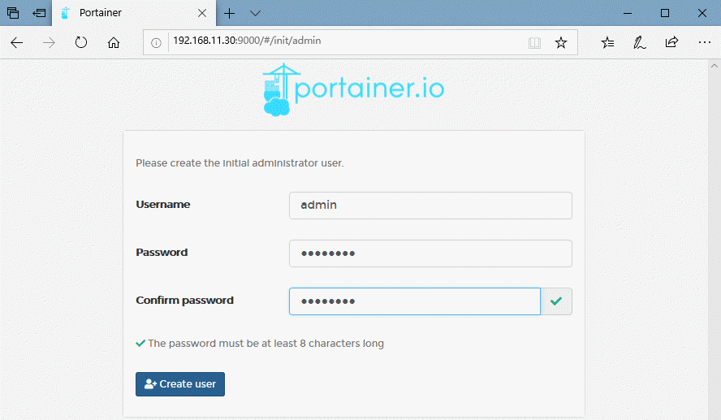
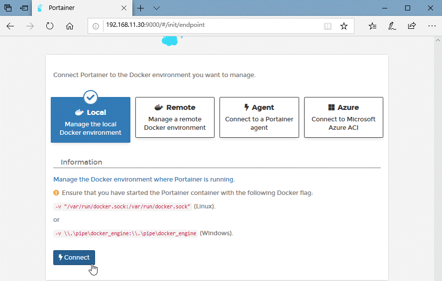
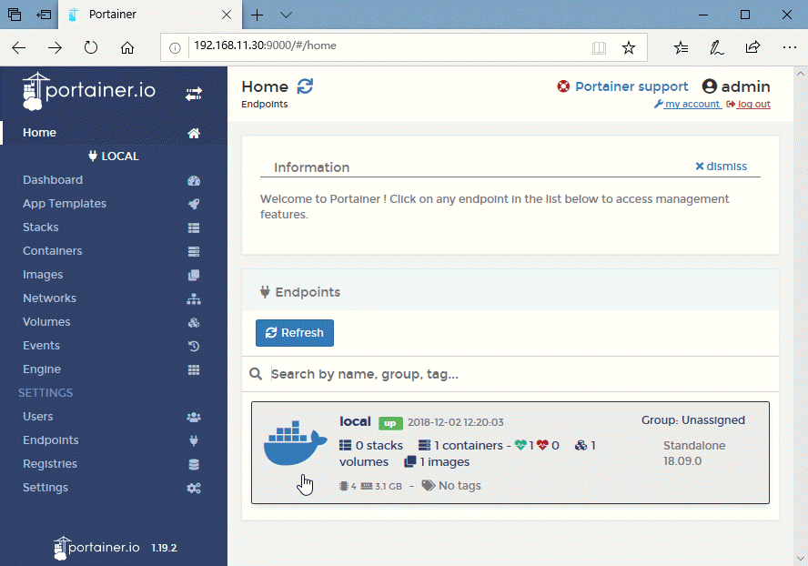
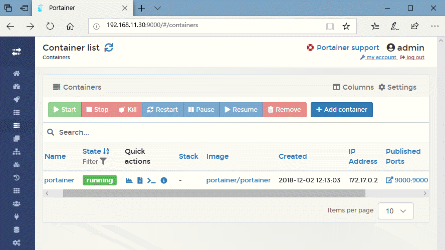

# LINUX安装Docker及Portainer可视化界面
## Docker安装前提
Docker要求是64位Linux。内核必须在最小为3.10，使用命令： uname -r 来显示内核版本。
## 安装Docker
### ubuntu命令安装
#### 删除老版本
```
$ sudo apt-get remove docker docker-engine docker.io
```
#### 使用源安装
##### 设置源
1. 刷新apt包索引
```
    $ sudo apt-get update
```
2. 安装相关软件包
```
    $ sudo apt-get install 
        apt-transport-https \
        ca-certificates \
        curl \
        software-properties-common
```
3. 添加Docker官方GPG密钥
```
    $ curl -fsSL https://download.docker.com/linux/ubuntu/gpg | sudo apt-key add -
    $ sudo apt-key fingerprint 0EBFCD88     //验证核实
```
```
    pub   rsa4096 2017-02-22 [SCEA]
        9DC8 5822 9FC7 DD38 854A  E2D8 8D81 803C 0EBF CD88
    uid           [ unknown] Docker Release (CE deb) <docker@docker.com>
    sub   rsa4096 2017-02-22 [S]
```
4. 添加稳定版本的源

    x86_64 / amd64架构
```
    $ sudo add-apt-repository \
    "deb [arch=amd64] https://download.docker.com/linux/ubuntu \
    $(lsb_release -cs) \
    stable"
```

    armhf架构
```
    //
    $ sudo add-apt-repository \
    "deb [arch=armhf] https://download.docker.com/linux/ubuntu \
    $(lsb_release -cs) \
    stable"
```
##### 安装DOCKER CE软件包
1. 刷新apt包索引
```
    $ sudo apt-get update
```
2. 安装最新版本的Docker CE
```
    $ sudo apt-get install docker-ce
```
##### 验证安装是否正常
```
    $ sudo docker run hello-world
```
其他详细内容[https://docs.docker.com/install/linux/docker-ce/ubuntu/](https://docs.docker.com/install/linux/docker-ce/ubuntu/)
### centos命令安装
#### 删除老版本
```
$ sudo yum remove docker \
                  docker-client \
                  docker-client-latest \
                  docker-common \
                  docker-latest \
                  docker-latest-logrotate \
                  docker-logrotate \
                  docker-selinux \
                  docker-engine-selinux \
                  docker-engine
```
#### 使用源安装
##### 设置源
1. 刷新apt包索引
```
    $ sudo yum update
```
2. 安装相关软件包
```
    $ sudo yum install -y yum-utils \
    device-mapper-persistent-data \
    lvm2
```
3. 添加稳定版本的源

    x86_64 / amd64架构
```
    $ sudo yum-config-manager \
        --add-repo \
        https://download.docker.com/linux/centos/docker-ce.repo
```
##### 安装DOCKER CE软件包
1. 刷新apt包索引
```
    $ sudo yum update
```
2. 安装最新版本的Docker CE
```
    $ sudo yum install docker-ce
```
3. 启动docker
```
    $ sudo systemctl start docker
```
4. 开机启动docker
```
    $ sudo systemctl enable docker
```
5. 验证安装是否正常
```
    $ sudo docker run hello-world
    Unable to find image 'hello-world:latest' locally
    latest: Pulling from library/hello-world
    d1725b59e92d: Pull complete
    Digest: sha256:0add3ace90ecb4adbf7777e9aacf18357296e799f81cabc9fde470971e499788
    Status: Downloaded newer image for hello-world:latest

    Hello from Docker!
    This message shows that your installation appears to be working correctly.

    To generate this message, Docker took the following steps:
    1. The Docker client contacted the Docker daemon.
    2. The Docker daemon pulled the "hello-world" image from the Docker Hub.
        (amd64)
    3. The Docker daemon created a new container from that image which runs the
        executable that produces the output you are currently reading.
    4. The Docker daemon streamed that output to the Docker client, which sent it
        to your terminal.

    To try something more ambitious, you can run an Ubuntu container with:
    $ docker run -it ubuntu bash

    Share images, automate workflows, and more with a free Docker ID:
    https://hub.docker.com/

    For more examples and ideas, visit:
    https://docs.docker.com/get-started/
 ```

其他详细内容[https://docs.docker.com/install/linux/docker-ce/centos/](https://docs.docker.com/install/linux/docker-ce/centos/)

## 何为Portainer?
Portainer是Docker的图形化管理工具，提供状态显示面板、应用模板快速部署、容器镜像网络数据卷的基本操作（包括上传下载镜像，创建容器等操作）、事件日志显示、容器控制台操作、Swarm集群和服务等集中管理和操作、登录用户管理和控制等功能。功能十分全面，基本能满足中小型单位对容器管理的全部需求。
## Docker安装Portainer镜像
### 查询Portainer镜像
``` 
$ sudo docker search portainer
NAME                                   DESCRIPTION                                     STARS  OFFICIAL  AUTOMATED
portainer/portainer                    A simple to use management user interface fo…   859                                     
hypriot/rpi-portainer                  A web interface for the Docker engine. Dead …   37                                      
portainer/templates                    App Templates for Portainer http://portainer…   14                                      
portainer/agent                        An agent used to manage all the resources in…   12                                      
portainer/golang-builder               Utility to build Golang binaries.               2 
......
```
### 下载Portainer镜像
```
$ sudo docker pull portainer/portainer
Using default tag: latest
latest: Pulling from portainer/portainer
d1e017099d17: Pull complete 
d4e5419541f5: Pull complete 
Digest: sha256:07c0e19e28e18414dd02c313c36b293758acf197d5af45077e3dd69c630e25cc
Status: Downloaded newer image for portainer/portainer:latest
```
## 本地运行
### 命令行设置启动
```
$ sudo docker volume create portainer_data
$ sudo docker run -d -p 9000:9000 \
            --name portainer \
            --restart always \
            -v /var/run/docker.sock:/var/run/docker.sock \
            -v portainer_data:/data \
            portainer/portainer
```
### 浏览器访问设置
访问主机9000端口(9000为启动时配置端口)

选择本地运行模式

进入本地管理项目

管理当前容器列表

## 集群运行及更多内容访问[https://portainer.readthedocs.io/en/latest/](https://portainer.readthedocs.io/en/latest/)
